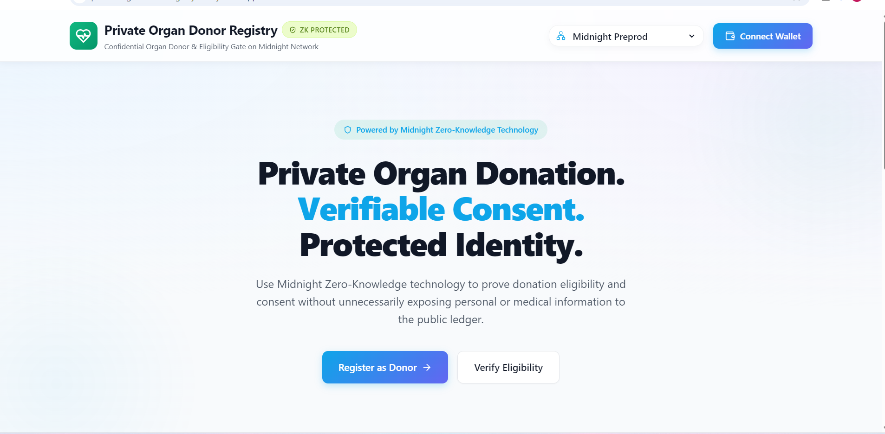
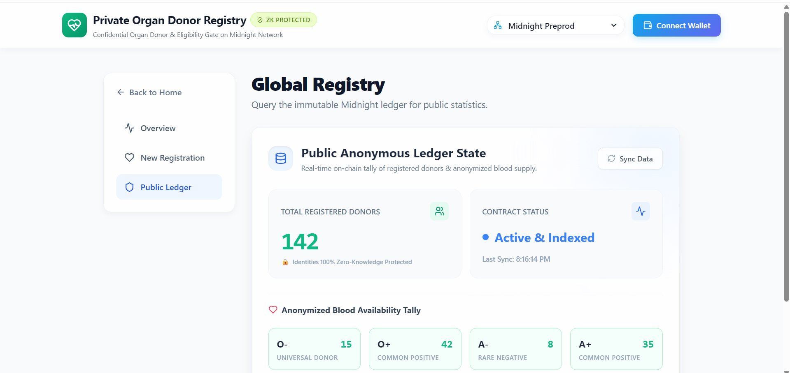

# 🛡️ Private Organ Donor Registry

Enterprise Zero-Knowledge Organ Donor Registration & Eligibility Verification built natively on the Midnight Network using Compact smart contracts, client-side ZK-SNARK proving, dual-state ledger privacy, and Next.js 15.

<p align="center">
  <a href="https://private-organ-donor-registry-next-j.vercel.app/"></a>
  <a href="https://www.youtube.com/watch?v=ce5IJDyWQX0"></a>
  <a href="https://explorer.preprod.midnight.network/?search=0x1e3a57110a038d73d0d8e23777ced0e087e75d3f9185add9c967d26daf28cab3"></a>
  <a href="https://github.com/sourasishbhaduri/private-organ-donor-registry-NextJs/actions"></a>
  
</p>

## 📸 Application Screenshots

| Screen | Description |
|--------|-------------|
| **Landing page** | **Overview & Landing Page**: Hero section showcasing mathematical privacy, connected Midnight wallet (`mn_addr...`), live Preprod network badge, and interactive zero-knowledge gateway.<br><br> |
| **Ledger Tally** | **Public Ledger Dashboard**: Real-time registry telemetry, sub-second ZK prover latency, live block height ticker, and on-chain commitment stream for aggregate blood supply metrics.<br><br> |
| **Public ledger** | **Zero-Knowledge Donor Registration**: Private witness execution, client-side medical clearance evaluation, and interactive WASM prover activity terminal.<br><br> |

## 🧠 Executive Summary & Problem Statement

### The Problem
Traditional organ donor registries require individuals to share highly sensitive medical and identifying information with a centralized database. This creates critical privacy flaws:
- **Raw Medical & PII Exposure**: Donors hand over their exact date of birth, identity, and medical conditions to centralized gatekeepers.
- **On-Chain Surveillance**: In standard blockchain registries, signing a transaction permanently links a public wallet address to sensitive medical decisions on an immutable public ledger.
- **Data Breach Vulnerabilities**: Centralized healthcare databases represent lucrative honeypots for credential and identity harvesting.

### The Solution
The Private Organ Donor Registry enables individuals to mathematically prove their eligibility and donation consent in Zero-Knowledge.
- No medical records or exact birth dates ever leave the donor's local device.
- No wallet identities or personal identifiable information (PII) are published on-chain.
- The Midnight ledger verifies the cryptographic proof, increments the aggregate donor supply counter, and records a one-way commitment hash.

## ⚙️ Working Principles & Cryptographic Flow

The Registry leverages Midnight's dual-state architecture where private witness execution is strictly isolated on the client side and only succinct ZK-SNARK proofs cross the network boundary:

```text
┌─────────────────────────────────────────────────────────────────────────────┐
│                          DONOR'S LOCAL CLIENT                               │
│                                                                             │
│  [ Secret Passphrase ] + [ Exact Age ] + [ Medical Clearance Seed ]         │
│          │                                                                  │
│          ▼  (Private witness execution strictly inside browser/WASM)        │
│  ┌──────────────────────────────────────────────┐                           │
│  │  Midnight Compact Circuit                    │                           │
│  │  - secretPassphrase() witness execution      │   ← Midnight Proof Server │
│  │  - verifyEligibility() constraint evaluation │     (localhost:6300)      │
│  │  - donorBloodType() statistical masking      │                           │
│  └──────────────────────┬───────────────────────┘                           │
│                         │                                                   │
│                         ▼  (ZK-SNARK Proof only)                            │
└─────────────────────────┼───────────────────────────────────────────────────┘
                          │
                          ▼ (Network Boundary: ZERO PII Transmitted)
┌─────────────────────────────────────────────────────────────────────────────┐
│                         MIDNIGHT PREPROD LEDGER                             │
│                                                                             │
│  PUBLIC ON-CHAIN STATE:                                                     │
│  ✅ totalDonors         — Aggregate counter incremented (+1)                │
│  ✅ lastCommitment      — One-way cryptographic fingerprint (SHA-256)       │
│  ✅ bloodSupplyCounts   — Anonymized aggregate metrics                      │
│                                                                             │
│  PROTECTED PRIVATE STATE (Never exposed or stored on-chain):                │
│  ❌ exactAge / DOB      — Plaintext integer                                 │
│  ❌ medicalClearance    — Client-side medical token                         │
│  ❌ donorWalletId       — Personal wallet address                           │
└─────────────────────────────────────────────────────────────────────────────┘
```

## 🛡️ Midnight Privacy Model Breakdown

| Parameter | Visibility | Storage Location | Cryptographic Guarantee |
|-----------|------------|------------------|-------------------------|
| **Exact Age** | 🔒 Private | Client RAM only | Never serialized over network; evaluated in ZK witness (age >= 18) |
| **Medical Clearance** | 🔒 Private | Ephemeral | Verified against constraints locally, destroyed after proof generation |
| **Donor Identity** | 🔒 Private | Off-Chain | Zero wallet-to-registry correlation on public ledger |
| **Donor Counter** | 🌐 Public | Midnight Ledger | Aggregate counter tracking verified organ donors |
| **Commitment Hash** | 🌐 Public | Midnight Ledger | One-way cryptographic fingerprint (`0x...`) |
| **Verifier Portal** | 🌐 Public | Midnight Ledger | Accessible by authorized hospital staff |

## 🔗 Deployed Contracts — Midnight Preprod

| Parameter | Value | Explorer Link |
|-----------|-------|---------------|
| **Active Contract (Latest)** | `0x1e3a57110a038d73d0d8e23777ced0e087e75d3f9185add9c967d26daf28cab3` | [🔍 View on Preprod Explorer](https://explorer.preprod.midnight.network/?search=0x1e3a57110a038d73d0d8e23777ced0e087e75d3f9185add9c967d26daf28cab3) |
| **Deployer Wallet** | `mn_addr_preprod1qlzf6h6zjhyms2p3y4vu5p278zqkqqaqk9nualrndghgxywseres5hth5u` | [Preprod Faucet](https://midnight-tmnight-preprod.nethermind.dev/) |

## 🔄 CI/CD Pipeline & Automated Quality Gates

Every commit and pull request is automatically validated through a comprehensive 5-stage GitHub Actions matrix (`.github/workflows/main.yml`):

```text
┌────────────────────────────────────────────────────────────────────────┐
│                     GITHUB ACTIONS CI/CD PIPELINE                      │
├───────────────────┬───────────────────┬────────────────────────────────┤
│ Job 1: ESLint     │ npm run lint      │ Code formatting & syntax audit │
│ Job 2: TypeCheck  │ npm run typecheck │ TypeScript strict compilation  │
│ Job 3: Compact ZK │ npm run compile   │ Circuit source & keys integrity│
│ Job 4: Vitest     │ npm test          │ Automated unit tests           │
│ Job 5: UI Build   │ npm run build     │ Production Next.js 15 bundle   │
└───────────────────┴───────────────────┴────────────────────────────────┘
```

## 📖 Step-by-Step Developer & Operator Guide

### 1. System Requirements & Prerequisites
- **Node.js**: v20.x or v22.x (LTS recommended)
- **Docker**: For running the local Midnight Proof Server
- **Browser Extension**: 1AM Wallet or Midnight Lace

### 2. Installation & Setup
```bash
# Clone repository
git clone https://github.com/sourasishbhaduri/private-organ-donor-registry-NextJs.git
cd private-organ-donor-registry-NextJs

# Install root & workspace dependencies
npm install
cd frontend && npm install --legacy-peer-deps
```

### 3. Start the Midnight Proof Server
Run the containerized Midnight Prover locally:
```bash
docker run -d --name vvp-proof-server -p 6300:6300 midnightntwrk/proof-server:8.1.0
```
Verify that the proof server is healthy:
```bash
curl -I http://localhost:6300
```

### 4. Fund Testnet Wallet
Get testnet `tDUST` / `tNIGHT` tokens from the official Nethermind Faucet:
- **Faucet URL**: [https://midnight-tmnight-preprod.nethermind.dev/](https://midnight-tmnight-preprod.nethermind.dev/)
- **Target Address**: `mn_addr_preprod1qlzf6h6zjhyms2p3y4vu5p278zqkqqaqk9nualrndghgxywseres5hth5u`

### 5. Launch the Web Application
```bash
cd frontend
npm run dev
```
Open [http://localhost:3000](http://localhost:3000)

### 6. Connect Wallet (1AM Wallet & Lace)
1. Click the "Connect Wallet" button in the top navigation bar.
2. The platform automatically scans `window.midnight` using the official `@midnight-ntwrk/dapp-connector-api` specification.
3. Select your detected wallet (1AM Wallet or Midnight Lace) and approve the authorization prompt.

### 7. Deploying Contracts to Midnight Preprod
```bash
npm run compile
# Deployment via Midnight CLI workflow
```

### 8. Run Automated Unit Tests
```bash
npm test
```

## ✅ Feature & Compliance Checklist

### Smart Contracts & ZK Circuits
- [x] Written in Midnight Compact Language (`contracts/bboard.compact`)
- [x] Private witness computation for passcodes, exact age, and medical clearance
- [x] Public state transitions for aggregate donor counters and commitment fingerprints
- [x] Zero PII exposure on public ledger state
- [x] `disclose()` used deliberately

### DApp & Wallet Connector
- [x] Built with Next.js 15 App Router and native TypeScript
- [x] Full compliance with official `@midnight-ntwrk/dapp-connector-api` v4 spec
- [x] Native support for 1AM Wallet and Midnight Lace via DApp connector
- [x] Development Seed Key fallback for local testing
- [x] Real-time interactive UI with glassmorphic SaaS design

### Performance & Security
- [x] Next.js 15 SSR optimization
- [x] Automated GitHub Actions CI/CD matrix
- [x] Production build passes

## 🏛️ Real-World Sector Use Cases

| Sector | Practical Application |
|--------|-----------------------|
| **Healthcare & Hospitals** | Donor verification and organ matching without violating HIPAA/GDPR confidentiality. |
| **Non-Profit Registries** | Global registries that encourage donation through absolute mathematical anonymity. |
| **Insurance Providers** | Verification of donor status for premium discounts without exposing underlying health risks. |
| **Research Institutions** | Aggregating statistical blood supply data globally without deanonymizing individuals. |

## 🛠️ Monorepo Structure

```text
private-organ-donor-registry-NextJs/
├── .github/
│   └── workflows/
│       └── main.yml           # Automated CI/CD pipeline
├── contracts/                 # Compact ZK smart contracts
│   ├── bboard.compact         # Compact circuit source code
│   └── managed/               # Compiled circuits, keys, and ZK bindings
├── frontend/                  # Next.js 15 Web Application
│   ├── src/
│   │   ├── app/               # App Router pages (Dashboard, Register, Verify, Records)
│   │   ├── components/        # WalletModal, Forms, ZK Components
│   │   ├── types.ts           # Global interfaces
│   │   └── utils/             # Web Crypto & Wallet Connection utilities
│   ├── package.json
│   └── tailwind.config.ts     # UI Theming System
├── test/                      # Integration tests
├── PROPOSAL.md                # In-depth Product & Architecture Proposal
└── README.md                  # Primary documentation & user guide
```

## 📄 License
This project is open-source and distributed under the MIT License. See `LICENSE` for details.
